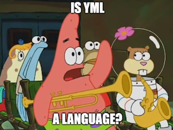

+++
aliases = ["experience"]
title = "Experience"
tags = ["experience", "skills"]
+++
Since 2022, I've been a Software Engineer at Microsoft. Developers, developers, developers! I develop internal tooling and infrastructure for developers in Windows and Azure.

Past experience includes:
* Full-stack web development @ Reprise
* Platform engineering @ Cogito
* Test automation @ Carbonite

Languages I love to use:
* Rust
* TypeScript
* C#
* 
