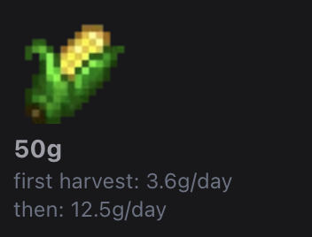

+++
title = "Dew I: overthinking cozy games"
summary = "or, frontloading hours of effort because I don't like reading and/or scrolling"
description = "or, frontloading hours of effort because I don't like reading and/or scrolling"
date = '2026-03-29'
tags = ['Next.js', 'project', 'mobile']
keywords = ['Stardew Valley', 'project', 'mobile development', 'Stardew Valley companion app']
showReadingTime = false
showComments = true
math = true
+++
If you know anything about me, you'll know that 90% of my gaming is done on Nintendo Switch 2 these days. 
(I already spend way too much time in front of computer screens, but I tell myself that a smaller screen isn't as bad 🙂)

[The Nintendo Switch 2 edition of Stardew Valley](https://www.nintendo.com/us/store/products/stardew-valley-nintendo-switch-2-edition-switch-2/) released a few months ago, and I know we're several years behind the curve but my partner and I got really, really hooked on it. 

Stardew Valley is frequently held up as the perfect "cozy game": it's low stress and low urgency, there's a predictable gameplay loop, and there are plenty of ways to make progress in any given session.

I mostly play RPG / strategy games, so I couldn't help but poison Stardew Valley's coziness with my screwed up optimizer brain ❤️

# Motivation
Let's say that I've just spent the last several in-game days tending to my [blueberry crops](https://stardewvalleywiki.com/Blueberry). 
Once I've harvested my blueberries, I have a few choices:

- **Sell** the blueberries as-is, collecting immediate profit
- **Process** the blueberries into wine, jelly, or dried fruit for even more profit
  - If I create wine, I can also choose to age the wine for even *more more* profit
- **Save** the blueberries for a recipe, which I can either sell or utilize during a mining excursion

I'd always get tripped up by this choice, asking myself questions like:

- If I use one of my processors for this crop, am I wasting space that could be utilized by a higher value output? (i.e., why put blueberries in the preserves jar as opposed to melon?)
- Processing always adds value, but am I wasting time by delaying sale for minimal payoff?
- If I make a bad choice, is it compounded by the amount of time I've already put into this harvest?

To be clear, this is wildly overthinking the game.
I can make any random choice and *usually* make some sort of profit. 
(Besides, profit isn't at all the most important aspect of Stardew Valley.
There are many other parts of the game to "win": relationships, collectibles, exploration, etc.)

Even still, I decided to throw together a small app that would help me answer some of these questions.
I spent a couple of months hacking on it - mostly in class, when I'd rather have been playing Stardew.

# Requirements
- **Mobile-first UI.** I'm a handheld main and it's easy to whip out my phone while playing. This could've been a cool opportunity to build a proper mobile app, but I figured a web app would be more ergonomic (+ platform agnostic). 
- **Low information density.** I'm well-aware that resources like the [amazing Stardew Valley wiki](https://stardewvalleywiki.com/Stardew_Valley_Wiki) already contain the majority of the info I need, and in the end I relied extensively relied on this wiki for data. When I'm actually playing the game though, I really hate browsing wikis. There's so much read, and information is scattered in many different places: tables, sidebars, related articles, etc. I want to search for an item and get easily digestible info about that item.
- **Optimizer brain insights.** I was very attached to this "gold per day" idea. It's hard to find this data online. Everyone derives the value differently, and it's subject to change given professions, item quality, etc. 
- **Dark mode.** My gaming habits are vampiric and I love you Stardew Valley wiki but you burn my eyes

# Building the thing
I chose to build this app using [Next.js](https://nextjs.org/) with [shadcdn](https://ui.shadcn.com/).
I knew it was going to be a simple project, so why not experiment with new stuff?

I worked out the initial architecture:
- Per-item data is stored in `items.json`.
- Relationships and transformations are stored in `recipes.json`. 
- The system is data-driven, so adding items or recipes shouldn't require source code modification.
- Base page consists of profession toggles, a search component, item details, and derived item details if applicable.

I built out the framework independently, then worked with my buddy Claude to finish it out and apply refactors as I identified opportunities for cleanup.
I used a simple script to scrape the Stardew Valley wiki for data and sprites, although I ended up making many semi-manual edits to the data as my schema changed.

The data was probably the most painful part of this project. My .json files ended up being massive - ~4000 LOC each.
My self-imposed data-driven requirement was harder to achieve than expected.
I can't imagine how Stardew Valley internally manages items and recipes, because there's so much weird nuance to account for.
For example, I had to redo my profession system because of [blackberries](https://stardewvalleywiki.com/Blackberry), which are (I think?) the only item with special Tiller + Bear's Knowledge pricing. 

## Calculations and limitations
To calculate gold per day, I went with the simplest possible formula: $\frac{sellPrice}{daysToMature}$.
`daysToMature` ignores the 1 day spent planting.

[Stardew Valley wiki's gold per day formula](https://stardewvalleywiki.com/Crops#Gold_per_Day) incorporates max harvests (assuming you grow + regrow the crop whenever possible) and seed price, but I thought this was way too complicated.
Seeds can be given or produced via [Seed Maker](https://stardewvalleywiki.com/Seed_Maker) so it feels weird to assign each crop a definitive seed price.
My optimizer brain also resists this idea of "max harvests". 
Generally, I plant whatever I want, whenever I want, so this metric doesn't make much sense to me.

I had to address crops that regrow (they basically have two different `daysToMature` values), so I chose to keep it simple and add this calculation: : $\frac{sellPrice}{daysToRegrow}$ 

I display both in item details:

For processed items, I use this formula: $\frac{outputValue - inputCost}{processingDays}$. 
The dehydrator further divides this value by `inputQuantity`.

I don't include the original crop growth time in the processed item's gold per day formula.
I wanted to answer the question, "how profitable would it be to use this processor right now?" and cared less about end-to-end profit, because I already knew that processors (almost) always improve profit.

Other random limitations:
- I assumed that [honey](https://stardewvalleywiki.com/Honey) has base sell price of 100. In reality, its sell price is affected by nearby flowers. You could argue that honey of varying value is a derived product of flower. I've never really gamed honey or flowers so I chose to omit this mechanic. 
- I eventually added support for fish and [roe](https://stardewvalleywiki.com/Roe). If I taught my data about ponds, then I could theoretically figure out "dew I sell this fish or put it in a pond to advance roe production?" but again, I don't really play the pond game so I just left it out.
- It's easy to determine `processingDays` for something like a Preserves Jar, but harder for something like a Mayonnaise Machine. I used fractional days to account for this, which aligns with the Stardew Valley wiki's approach to modeling [non-trivial processing time](https://stardewvalleywiki.com/Keg#Products).

There's probably more that I'm forgetting.
The depth of this game is actually insane, and although I learned a few rules of thumb through the data (e.g., if you don't have the Artisan profession, it's almost always better to sell raw iridium crops vs. processing to jelly or juice), a lot of the meta is still opaque to me.

# Result
Dewi is hosted at a URL near you: [https://dewi.gibby.dev/](https://dewi.gibby.dev/).


I'm pretty happy with how it turned out!
Although very simple, it was a fun way to mess around with Next.js. 
I'll probably stick with Svelte, but I can see the appeal.

Ironically, I've mostly gotten over my Stardew fever since I finished this project, so I haven't really used it much :D
The 1.7 update is just around the corner, so I'm sure I'll revisit it soon.