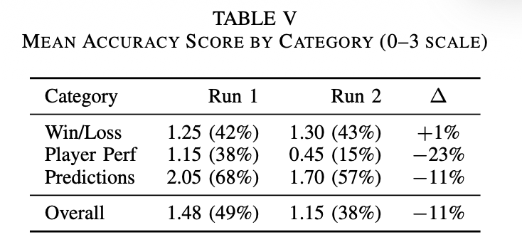
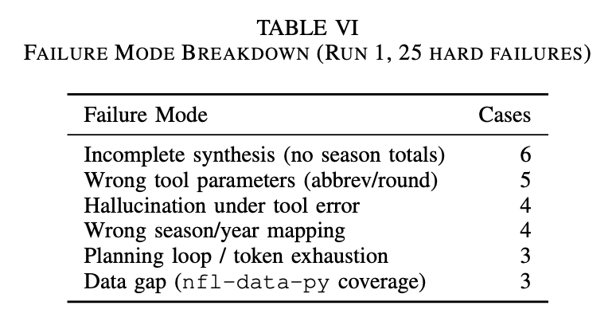

+++
title = "Picksix: baby's first agentic app"
summary = "51% accuracy?! Look out, Skip Bayless!"
description = "51% accuracy?! Look out, Skip Bayless!"
date = '2026-07-11'
tags = ['AI', 'project', 'Python']
keywords = ['NFL AI', 'NFL agent', 'agentic app']
showReadingTime = false
showComments = true
+++
A couple months ago, I completed my techbro rite of passage and developed an agentic application.
In my defense, I did it for class. In my offense, I had fun working on it.

I chose to build an NFL analyst agent for a few reasons:
- [Football is the most popular sport in the United States (where I live)](https://news.gallup.com/poll/610046/football-retains-dominant-position-favorite-sport.aspx) so it offers a rich dataset. There are plenty of APIs to query, and - if need be - plenty of websites to scrape for data.
- Most queries about sports are easily verifiable. I'd come to learn that there's still lots of subjectivity when grading responses, but it's still an easy-ish domain to fact check. 
- I love the NFL and I badly miss it during the offseason.

Naturally, I named it after [the coolest play in football](https://en.wikipedia.org/wiki/Interception#Gridiron_football).

## Environment setup
I ran the agent backend on a Google Cloud TPU v5 VM, using [`vllm-tpu`](https://docs.vllm.ai/projects/tpu/en/latest/) to serve Qwen3-4B. 
I hoped to use Qwen3-8B for this project, but my TPU's 16 GB HBM was insufficient to load 8B model weights.
Qwen3-4B fit comfortably at `--gpu-memory-utilization=0.95` with a maximum context length of 8,192 tokens.

I served the model like this:

```sh
~/.local/bin/vllm serve "Qwen/Qwen3-4B" \
    --download_dir /tmp \
    --tensor_parallel_size=1 \
    --max-model-len=8192 \
    --gpu-memory-utilization=0.95
```

It's a really simple configuration.
I could have experimented with flags like `--enable-prefix-caching` (caching the KV state for ~3000 token shared prefix in every planning prompt) or `--speculative-model` (reducing decode latency in the planning phase, which structured output as JSON) but I chose not to play with any of those settings.

## Supported query types + evaluation framework

I defined my three supported query types as follows:

- **Win/loss:** Explanations of game, season, and playoff outcomes. (e.g., "Why did the Ravens lose the 2024 AFC Divisional playoff game?" *seriously, why* 😭)
- **Player:** Summary of individual player performance, across games, seasons, or other runs. (e.g., "How did Derrick Henry perform in the 2020 season?")
- **Prediction:** Informed guesses about upcoming games. (e.g., "Will the Seahawks win their 2026 season opener?")

To appropriately challenge the agent, the evaluation set contains queries pertaining to seasons between 2019 and 2026. 
As it turns out, this choice increased complexity more than I expected, since [the number of games in a season increased from 16 to 17 in 2021](https://en.wikipedia.org/wiki/NFL_regular_season#Regular_season_expansion_(2021%E2%80%93present)). 
This made it trickier to map natural language game descriptions (e.g., 'the 2019 Wild Card round') to game numbers.

I was inspired by [FActScore (Factual precision in Atomicity Score)](https://arxiv.org/pdf/2305.14251) when considering how to grade responses.
For each query, I identified a list of key facts that I would expect an ideal response to contain. 
Here's what an entry in my evaluation set looks like:

```json
{
    "id": "winloss_004",
    "category": "win_loss",
    "season": 2022,
    "query": "How did the Philadelphia Eagles' 2022 season end?",
    "key_facts": [
        "Finished 14-3, best record in the NFC",
        "Won NFC East division title",
        "Beat Giants 38-7 in Divisional round and 49ers 31-7 in NFC Championship",
        "Lost Super Bowl LVII to the Kansas City Chiefs 38-35",
        "Led 24-14 at halftime of the Super Bowl before losing"
    ],
    "required_tools": [
        "get_game_results"
    ],
},
```

When evaluating via FActScore, key facts are weighted for importance, but I used unweighted grading for the sake of simplicity. 
In hindsight, weighing the key facts probably would have helped inflate my accuracy metrics.

In the above example, a fact like `"Finished 14-3, best record in the NFC"` is super important - if I'm asking about a season outcome, then I absolutely expect to receive info about regular season records.
Facts like `"Led 24-14 at halftime of the Super Bowl before losing"` are maybe less critical.
In an ideal response, they help tell an interesting story of the overall season, but a conclusion like "they lost the Super Bowl" is also fine.

Given the agent's response, I computed a final score with the following criteria:

- 0 = wrong or no key facts present
- 1 = some key facts correct
- 2 = most key facts correct
- 3 = all key facts correct

This subjective "some / most / all" determination partially depended on the number of key facts included in the response, but it also left room for subjective judgment (e.g., a key fact's game is mentioned, but not the final score.)

Claude helped me generate 20 example queries (with key facts) for each type, and I spot-checked various queries in each set for accuracy.
I also used Claude to grade responses with similar human oversight. 

## Tool layer
### `nfl_data_py`
To answer these queries, the agent needs access to data. 
I wrapped [`nfl_data_py`](https://pypi.org/project/nfl-data-py/) to expose various endpoints as tool calls, using a tool registry to explain how each tool should be used.
Here's an example registry entry:

```json
{
    "type": "function",
    "function": {
        "name": "get_player_stats",
        "description": (
            "Returns week-by-week player stats enriched with Next Gen Stats (air yards, "
            "separation, expected completion %, rush efficiency, etc.) and snap counts. "
            "Use for any query about a specific player's performance, trends, or situational "
            "splits (e.g. cold weather, primetime, vs specific opponents). "
            "Call multiple times with different stat_types to get a full picture — e.g. a QB "
            "may need both 'passing' and 'rushing'."
        ),
        "parameters": {
            "type": "object",
            "properties": {
                "player": {
                    "type": "string",
                    "description": "Full player name, e.g. 'Justin Herbert'. Must be exact."
                },
                "seasons": {
                    "type": "array",
                    "items": {"type": "integer"},
                    "description": "Season years to pull, e.g. [2022, 2023, 2024]. Include multiple seasons for trend analysis."
                },
                "stat_type": {
                    "type": "string",
                    "enum": ["passing", "rushing", "receiving"],
                    "description": "Category of stats. Use 'passing' for QBs, 'rushing' for RBs, 'receiving' for WRs/TEs."
                },
            },
            "required": ["player", "seasons", "stat_type"],
        },
    },
},
```

Most of my functions were simple wrappers around other `nfl_data_py` functions, including small conveniences like mapping player names to player IDs or reshaping output to an easily digestible format.
Other functions, like `get_playoff_game` orchestrate several `nfl_data_py` functions. (It was very hard to guide the agent to accurately map natural language game descriptions to `nfl_data_py` game entries.)

### `ddgs`
For the most part, `nfl_data_py` contained all the data that my agent needed to answer queries.
I couldn't teach the agent how to leverage these tool calls for prediction queries, though.
I'm not sure what I expected - maybe that the agent would make inferences about the future given historical trends? 

In any case, I greatly improved accuracy in prediction query responses by adding a simple tool that wraps [`ddgs`](https://pypi.org/project/ddgs/):

```py
def web_search(query: str, max_results: int = 5) -> dict:
    """
    Search the web for current information not available in nfl-data-py.
    Use for future-season predictions, recent news, injury updates, or
    anything requiring information beyond historical NFL data.
    """
    with DDGS() as ddgs:
        results = ddgs.text(query, max_results=max_results)

    return {
        "query": query,
        "results": [
            {"title": r.get("title"), "snippet": r.get("body"), "url": r.get("href")}
            for r in results
        ],
    }
```

In the end, Picksix achieved highest accuracy in the prediction category, which was very unexpected:



I suspect this is because web search returns pre-synthesized analyst content (betting odds, predictions, expert takes, etc) that mapped cleanly onto prediction queries.
By contrast, `nfl-data-py` returns raw tabular data, and the 4B model struggled to compute totals and reason across multiple rows.

## Initial planning and decomposition implementation
My first Picksix implementation followed the [planning and decomposition pattern](https://zeroentropy.dev/concepts/planning-decomposition/).
In this pattern, the agent produces a plan (in my case, a selection of tool calls, which are then executed in parallel). 
Given the output of all tool calls, the agent synthesizes a response.

Honestly, I don't think this pattern was a good fit for the problem space.
I chose it during the project proposal phase, so I stuck with it during execution.
My agent was really bad at handling and understanding tools calls:



Since planning is completed in a single pass, if the agent received subpar tool output, it would yolo that subpar data into its final response, leading to hallucinated or incomplete answers.
I tried to address this with prompt tuning ("make no mistakes" xD) but this exchanged one failure mode for another as the agent provided unhelpful refusals whenever it was intimidated by tool output.

## Slightly better ReAct implementation
The planning and decomposition implementation achieved embarrassing accuracy (in the ~%40 range) and I was determined to improve it. 
I figure that a [ReAct-style](https://arxiv.org/pdf/2210.03629) loop would achieve better accuracy. 

With the ReAct implementation, the model makes iterative tool calls.
Given the output of a tool call, it may choose to make another tool call.
In theory, this enables adaptive multi-step reasoning in exchange for added latency.
(You can also imagine how this could lead to an infinite loop of tool calls, so the ReAct loop is usually implemented with an iteration cap.)

Ultimately, the ReAct implementation helped me drive accuracy up to... 51%! 
So, still pretty embarrassing, but at least it's an improvement.
I suspect that I could have driven accuracy even further by either:

- Loosening evaluation criteria, either weighing key facts to provide more generous 'partial credit' or by manually defining 'gold answers' and grading by similarity.
- Improving tool layer ergonomics. I could have fit the tool layer to the query set (e.g., implement `player_comparison` or `historical_record`), or at least pre-processed tool output more aggressively to reduce load on the synthesizer.

Although I was tempted to implement these optimizations, I was absolutely mortified by the GCP bill that I ran up during the ~2 days that I hacked away at Picksix 😅
It kills me to leave a project in a suboptimal state, but I've given Google enough of my money for now.



I've tried and failed to build agent-like systems during timeboxed experiments at work, so it was cool to sit down and learn the basics of implementing an agent the 'right way'.
There are tons of levers to play with, so it's a huge time sink, but you can get creative with it too, which I always enjoy.